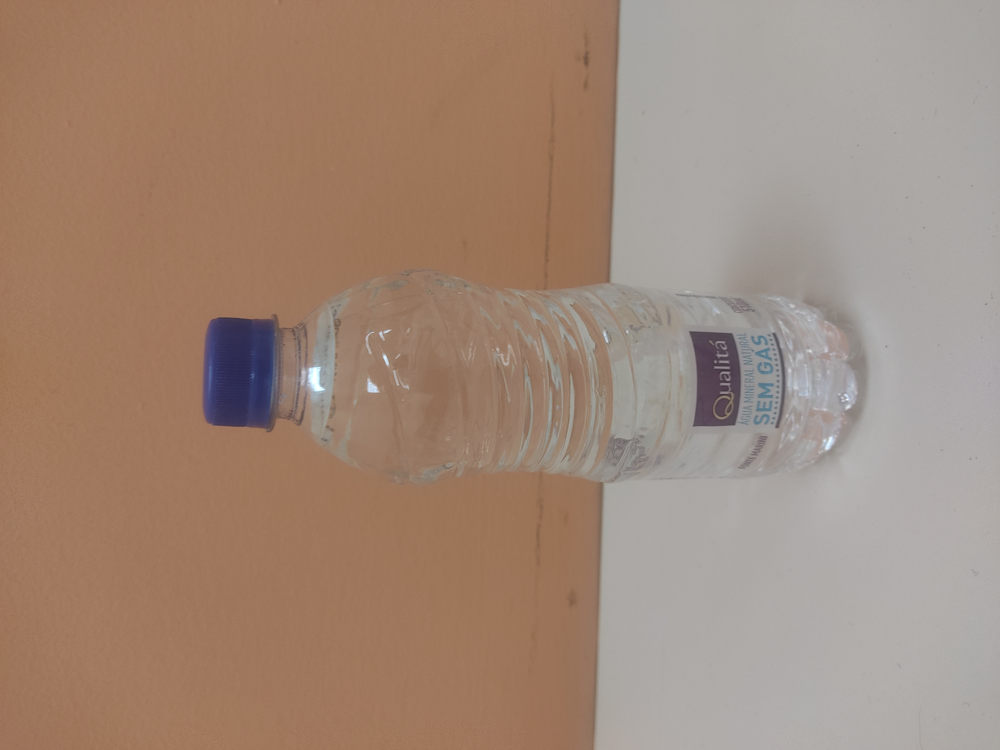

# Robocup@HOME - Latin America - 2022 - São Bernardo Do Campo

- [Schedule](schedule.pdf)
- [Names](name.pdf)
- [Questions](questions.pdf)
- [Scores](scores.pdf)

## Objects:

<table>
  <tr>
    <th>Drinks</th>
    <th>Cleaning supplies</th>
    <th>Pantry items</th>
    <th>Fruits</th>
    <th>Snacks</th>
    <th>Cutlery</th>
  </tr>
  <tr>
    <td>Coconut Water</td>
    <td>Cleaner</td>
    <td>Corn Flakes</td>
    <td>Apple</td>
    <td>Cookie</td>
    <td>Spoon</td>
  </tr>
  <tr>
    <td>Coke</td>
    <td>Cloth</td>
    <td>English Sauce</td>
    <td>Banana</td>
    <td>Pringles</td>
    <td>Fork</td>
  </tr>
  <tr>
    <td>Guarana</td>
    <td>Sponge</td>
    <td>Mustard</td>
    <td>Orange</td>
    <td></td>
    <td>Knife</td>
  </tr>
  <tr>
    <td>Ice Tea</td>
    <td></td>
    <td>Tomato Sauce</td>
    <td>Kiwi</td>
    <td></td>
    <td>Plate</td>
  </tr>
  <tr>
    <td>Tonic</td>
    <td></td>
    <td>Tuna Can</td>
    <td></td>
    <td></td>
    <td>Bowl</td>
  </tr>
  <tr>
    <td>Water</td>
    <td></td>
    <td>Corn Flakes</td>
    <td></td>
    <td></td>
    <td>Mug</td>
  </tr>
</table>

## Others Objects:

<table>
  <tr>
    <td>Bag</td>
    <td>Garbage_Bin</td>
    <td>Garbage Lid</td>
    <td>Garbage</td>
  </tr>
<table>

## Arena layout:

<table>
  <tr>
    <td></td>
    <td></td>
    <td></td>
  </tr>
    <tr>
    <td></td>
    <td></td>
    <td></td>
  </tr>

<table>

